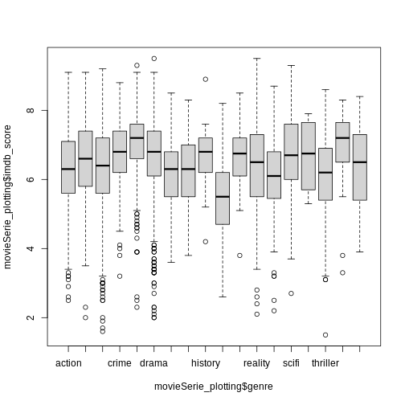
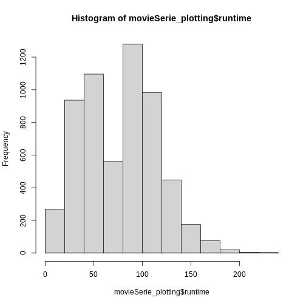

:::: questions:

- How do I create scatterplots, boxplots, and barplots?
- How can I define my own functions?

::::  


:::: objectives:

- Produce scatter plots and boxplots using Base R.
- Write your own function
- Write loops to repeat calculations
- Use logical tests in loops

::::


In case you have made changes to the original object we made. We read in the data
in a new object


``` r
movieSerie_plotting <- read_csv("data/movieSerie.csv", na = c("NA", "NULL"))
```

``` output
Rows: 5850 Columns: 14
── Column specification ────────────────────────────────────────────────────────
Delimiter: ","
chr (7): id, title, type, genre, description, age_certification, imdb_id
dbl (7): release_year, runtime, seasons, imdb_score, imdb_votes, tmdb_popula...

ℹ Use `spec()` to retrieve the full column specification for this data.
ℹ Specify the column types or set `show_col_types = FALSE` to quiet this message.
```


## Scatterplots ## 

Scatterplots visualizes the relation between two variables in the dataset, by
plotting individual observations in a two-dimensional graph, with the position 
in the x,y-plane defined by the values of the two variables.

The default plot function in Base R takes two vectors, one containing the values 
of the x-axis and one containing the values for the y-axis. Here we use the 
$-notation:


``` r
plot(movieSerie_plotting$release_year, movieSerie_plotting$imdb_score)
```


Scatterplots are useful for showing that sort for relationships in the data.
Here it does not appear that the correlation exists; there is no clear trend.

We might want to adjust the labels on the axes, and add a main title:

``` r
plot(movieSerie_plotting$release_year, movieSerie_plotting$imdb_score, 
     main = "Relation between release date and their imdb_score",
     xlab = "Release year",
     ylab = "imdb score")
```


## Boxplots 
We can use boxplots to visualize the distribution of number of imdb_score for genre:

``` r
boxplot(movieSerie_plotting$imdb_score~movieSerie_plotting$genre)
```


Two new things happens here. First, we are using a new way of telling the 
plot function what relationship we want to visualise. 
The function notation y~x, tells the boxplot function that we want to visualise
y as a function of x. In this case we want to visualise the number of people, as 
af function of the wall type. 
Secondly, we use a boxplot. A boxplots shows the distribution of the values on 
the y-axis. The median value is indicated by the solid bar.
The box encapsulates 50% of the observations. Its upper and lower borders 
represents the interquartile range (IQR). 
The whiskers on the plot - here only the upper whiskers are shown due to the
nature of the data, represents the range of the data. The distance from the 
upper part of the box, to the whisker is 1.5 times the interquartile range.
The dots that we see for muddaub and sunbricks are outliers. Observations that
lies so far from the rest of the observations, that we consider them as 
outliers.

Depending on the data, and the nature of the analyses we are going to do,
outliers are either very interesting, or something that we can ignore.

## Histograms

Another useful plottype are histograms. 

``` r
hist(movieSerie_plotting$runtime)
```



Histograms counts the number of observations in our data, that lies between 
two values. Here the "breaks" between the values on the x-axis corresponds
nicely to the number of people, but they do not have to.

## Writing our own functions ##

When calculating an average of several values, we do two things. First we
count how many values there are. Then we sum all the values, and divides the sum
by the number of values. 
Rather than writing R-code for each of these three operations, we use the 
mean() function, where other more experienced programmers have written the code.

We can write our own functions, where we collect several operations into one 
function. 

Functions in R are defined in this way:

``` r
function_name <- function(x){
  temporary_result_1 <- some_function(x)
  temporary_result_2 <- some_other_function(temporary_result_1)
  yet_another_function(temporary_result_2)
}
```

function_name defines the name of our function.

function(x) tells R that we are defining a function, that takes X as input.
We can then use that x as input to calculations or other functions within our
own function.

Between the curly braces {}, we define what we want our function to do.
We assign the result of some_function(x) to a temporary result, use that as
the input to a second function, and the result of that as the input to a third 
function. The result of the last calculation we do, will be returned as the 
output of our function.

:::: challenge

## Exercise:

Write a function that calculates the average value of a numeric vector, 
takes the square root of that average, and returns the result

::::

:::: solution

## Solution
One way to do this would be:
 
root_mean <- function(x){
              sqrt(mean(x, na.rm=T))
               }
 
 Another way could be:
 
 root_mean <- function(x){
              temp <- mean(x, na.rm =T)>             result <- sqrt(temp)
              result
 }
 
::::

## Logical tests in functions
Some times we want to do something different to the data, depending on the
data. We can control the flow of the code using the if() construction.

As an example:
if(x<10){
  print("X is smaller than 10")
}else{
  print("x is larger than 10")
}

The if() function will run the code provided in the curly braces {}, if, and 
only if, the expression in the paranthesis is true. If x is 11, x is not  
smaller than 10, and the first print function will not be executed.

The else-part is not requiered, but normally we will have to execute some other 
code if the statement in the if-function is not true. In this case if x is 11, 
the first print-function will not be executed, but the second will.

We use logical tests to handle data differently, depending on some characteristics of the data.

## loops

Loops are constructs we use to do the same operations on lots of data.

### for loops
For loops are constructs used to apply one or more functions on a series of data.


``` r
for(i in 1:10){
  temp <- sqrt(i)
  print(temp)
}
```

``` output
[1] 1
[1] 1.414214
[1] 1.732051
[1] 2
[1] 2.236068
[1] 2.44949
[1] 2.645751
[1] 2.828427
[1] 3
[1] 3.162278
```

will take every value in the vector 1:10, the digits 1 to 10, one by one, assign 
it to a temporary variable i and run the code we write in the curly braces.
Here the for-loop will take all numbers from 1 to 10, calculate the
squareroot of them. The result is assigned to another temporary variable "temp"
and then temp is printed.

#### Danger Will Robinson

As a general rule, R does not handle loops very efficiently. This is a simple 
loop, operating on only 10 values, and we wont notice the difference in speed.

But we can measure it. 

The Sys.time() function will tell us what time our computer thinks it is.
If we run that just before, and just after our loop, we can calculate how long
it took to run.

``` r
tic <- Sys.time()
for(i in 1:1000){
  temp <- sqrt(i)
  print(temp)
}
toc <- Sys.time()
for_time <- toc - tic
```


A more efficient way to calculate the square root of the numbers from 1 to 10
would be use the fact that sqrt() is a vectorized function that will calculate 
the square root of every element in a vector used as input to it:


``` r
tic <- Sys.time()
sqrt(1:1000)
toc <- Sys.time()
vect_time <- toc - tic
vect_time
```

And we can then compare how much faster the latter vectorized solution is.

``` r
as.numeric(for_time)/as.numeric(vect_time)
```

``` output
[1] 10.03247
```
More than double as fast!
To be fair most of the time is spent outputting the results, but as a general
rule utilizing the vectorized nature of functions is faster than writing loops.
But that is not always a luxury we have.

### while loops
While loops are loops that execute the code - as long as some criterium is satisfied.

``` r
i <- 1
while(i <= 10){
  print(sqrt(i))
  i <- i + 1
}
```

``` output
[1] 1
[1] 1.414214
[1] 1.732051
[1] 2
[1] 2.236068
[1] 2.44949
[1] 2.645751
[1] 2.828427
[1] 3
[1] 3.162278
```
This loop structure does the exact same as the two previous examples.
Here we need to assign an initial value i, and then our while loop will execute
the code within the curly braces, as long as i is smaller than or equal to 10.
It is important to remember to increment the value of i - otherwise i will always
be 1, and therefore always smaller than 10. And the loop will never stop.

## ggplot

The plotting functions in R produce nice clean plots without any fancy details.
That is generally a good thing, we want to maximize the information per ink in our plots.

However, we are limited in the types of plots we can make, and sometimes we just want a 
bit more color.

Enter ggplot2.

ggplot2 is a package designed to work well with the packages we have already 
encountered. It produces plots in a structured way, and comes with a lot of 
extensions, that enables us to plot almost anything.

The basic structure of ggplots are:

``` r
ggplot(data, mapping = aes(x=x, y=y)) +
  geom_point()
```

ggplot takes some data. Typically we will provide the data using the pipe: ` %>% `  


``` r
data %>% 
  ggplot(mapping = aes(x=x, y=y)) +
    geom_point()
```

The `mapping` argument tells ggplot which variables in our data should be mapped 
to the x- and y-axes in our plot.

That in itself will not produce much of a plot. We need to tell ggplot which type
of plot we want. 

We do that by adding a `geom_` function. Here we have added `geom_point` which
produces a scatter-plot. Other functions are more intuitively named. `geom_col`
gives us a column-plot, `geom_histogram` a histogram etc.

Let us try to make a histogram like we saw earlier:

``` r
interviews_plotting %>% 
  ggplot(aes(x=no_membrs)) +
  geom_histogram()
```

``` error
Error in eval(expr, envir, enclos): object 'interviews_plotting' not found
```
It looks different, and we get a warning about `binwidth`. geom_histogram automatically
chooses 30 bins for us, and that is normally not the right number.

:::: keypoints

- Boxplots are useful for visualizing the distribution of a continuous variable.
- Barplots are useful for visualizing categorical data.
- Functions allows you to repeat the same set of operations again and again.
- Loops allows you to apply the same function to lots of data.
- Logical tests allow you to apply different calculations on different sets of data.

::::

